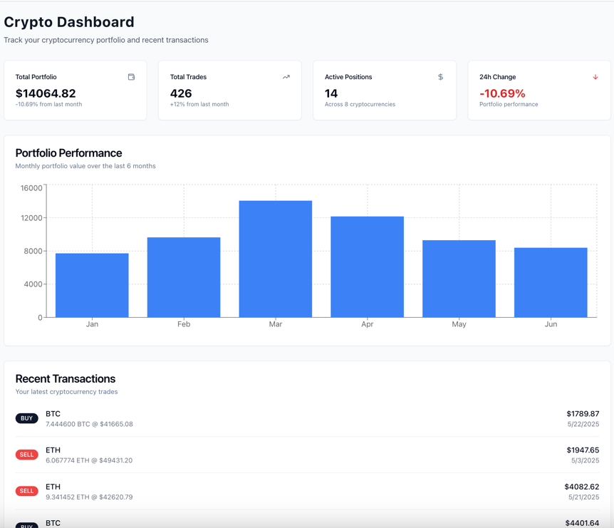

# Crypto Dashboard

Cryptocurrency portfolio dashboard built with Next.js, showcasing portfolio management and trading data visualization.

## 🚀 Live Demo

[View Live Dashboard](https://crypto-dashboard-sigma-bay.vercel.app/)

## 📸 Screenshots



## ✨ Features

- **Portfolio Overview**: Real-time portfolio value with performance metrics
- **Interactive Charts**: Bar chart showing portfolio performance over time
- **Transaction History**: Detailed view of recent buy/sell transactions
- **MUI**: Built with ShadCN/UI components and Tailwind CSS

## 🛠️ Tech Stack

- **Frontend**: Next.js 15, React, TypeScript
- **Styling**: Tailwind CSS, ShadCN/UI
- **Charts**: Recharts
- **Data**: Faker.js for realistic mock data
- **Icons**: Lucide React
- **Deployment**: Vercel

## 🏃‍♂️ Getting Started

### Prerequisites

- Node.js 18+ 
- npm or yarn

### Installation

1. Clone the repository
```bash
git clone https://github.com/aabidi90/crypto-dashboard.git
cd crypto-dashboard
```

2. Install dependencies
```bash
npm install
```

3. Run the development server
```bash
npm run dev
```

4. Open [http://localhost:3000](http://localhost:3000) in your browser

## 📁 Project Structure

```
crypto-dashboard/
├── src/
│   ├── app/
│   │   ├── globals.css
│   │   ├── layout.tsx
│   │   └── page.tsx
│   ├── components/
│   │   └── ui/
│       ├── card.tsx
│       ├── badge.tsx
│       └── button.tsx
├── public/
├── README.md
├── package.json
└── tailwind.config.js
```

## 🎯 Key Components

- **Responsive Grid**: Mobile-first responsive layout

## 🚀 Deployment

This project is deployed on Vercel with automatic deployments from the main branch.

[](https://vercel.com/new/clone?repository-url=https://github.com/aabidi90/crypto-dashboard)


## 📝 Notes

This dashboard uses mock data generated by Faker.js to simulate a realistic crypto trading experience. In a production environment, this would be connected to real cryptocurrency APIs.

## 👨‍💻 Developer

Built as part of a technical assessment.

---

**Happy Trading!** 📈